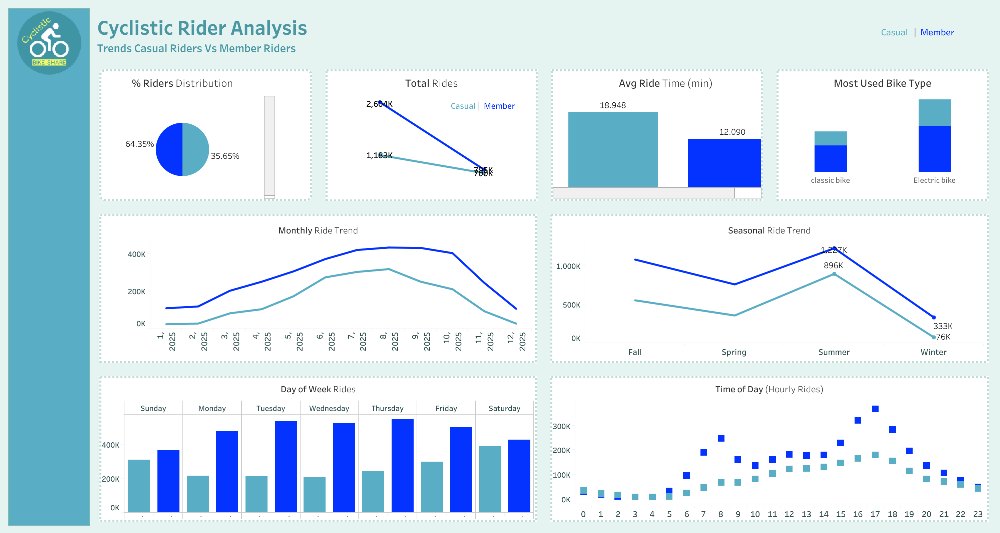

# 🚲 Cyclistic Bike-Share Analysis

## 📊 Dashboard Preview



## 🔗 Interactive Tableau Dashboard

👉 👉 [Download / View Dashboard]https://drive.google.com/file/d/1yG-AMsqntS0nkwZeYOmRWV3KYbFZyQHR/view?usp=drive_link

---

## 📌 Project Overview

This project analyzes Cyclistic bike-share data to understand behavioral differences between **casual riders** and **annual members**. The goal is to identify key usage patterns and provide insights that can help convert casual users into long-term members.

---

## 🎯 Business Objective

* Understand how casual riders and members use the service differently
* Identify trends in ride frequency, duration, and preferences
* Provide actionable insights for marketing and user conversion strategies

---

## 📈 Key Insights

* **Members contribute the majority of total rides**, indicating consistent usage behavior
* **Weekday rides are higher than weekends** for both user groups, suggesting commuting patterns
* **Ride activity peaks during summer**, showing strong seasonal demand
* **Casual riders have longer average ride durations**, indicating leisure usage
* **Electric bikes are the most preferred bike type** across both segments
* **Peak ride times occur during afternoon and evening hours**

---

## 🛠 Tools & Technologies

* **SQL (BigQuery)** → Data cleaning and analysis
* **Tableau** → Data visualization and dashboard creation
* **Excel** → Initial data handling

---

## 📊 Dashboard Features

* Rider distribution (Casual vs Member)
* Monthly ride trends
* Seasonal usage analysis
* Weekday vs Weekend ride comparison
* Time-of-day ride frequency
* Bike type preferences
* Average ride duration comparison

---

## 📂 Project Structure

```
Cyclistic-BikeShare-Analysis/
│
├── sql/
│   ├── data_cleaning.sql
│   ├── analysis.sql
│
├── dashboard.png
└── README.md
```

---

## 🚀 Conclusion

The analysis highlights clear behavioral differences between casual riders and members. Members tend to use bikes for routine, weekday travel, while casual riders exhibit more flexible and longer rides. These insights can help Cyclistic design targeted strategies to convert casual users into annual members.

